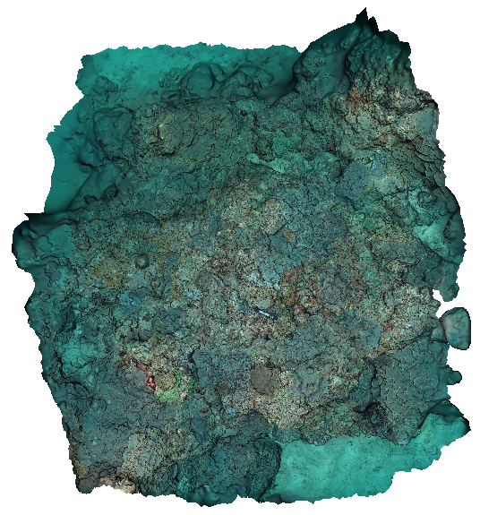
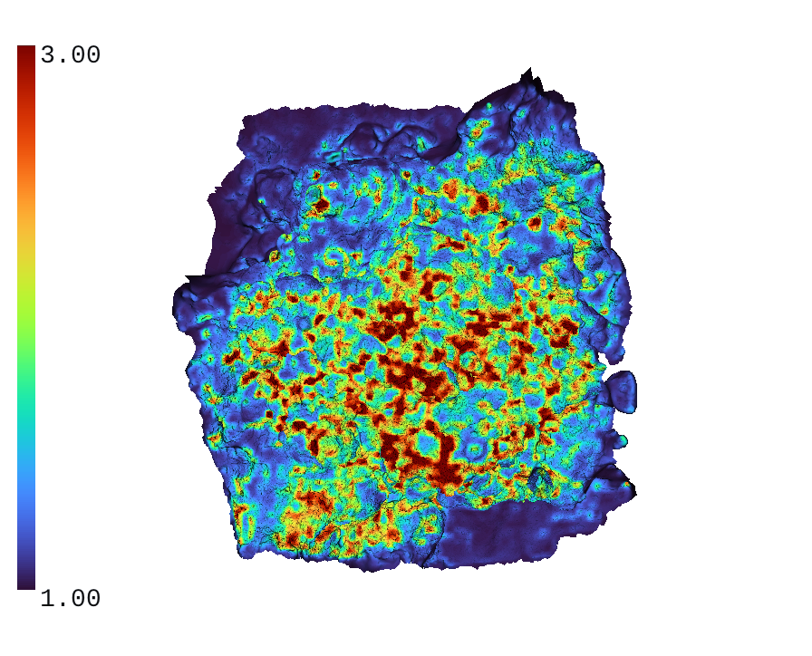

# Reef3D-Viewer

A demo of photogrammetry-based 3D modeling of a coral reef, reconstructed with [Agisoft MetaShape](https://www.agisoft.com/) and displayed in the browser using [`<model-viewer>`](https://modelviewer.dev/).

**Live Demo:** https://shawnchen09.github.io/Reef3D-Viewer/

## Complexity Analysis

Surface complexity (rugosity) of the reconstructed reef was analyzed using [HabiCAT 3D](https://github.com/Azzinoth/HabiCAT3D), which computes rugosity directly on the 3D mesh and exports it as a color-mapped visualization.

| Color | Rugosity |
| --- | --- |
|  |  |
